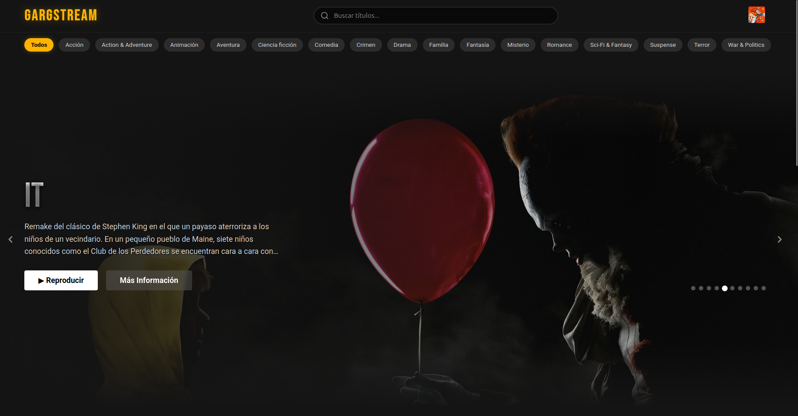
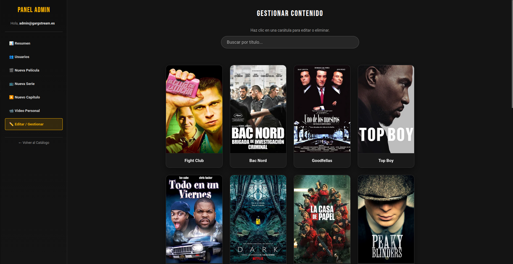
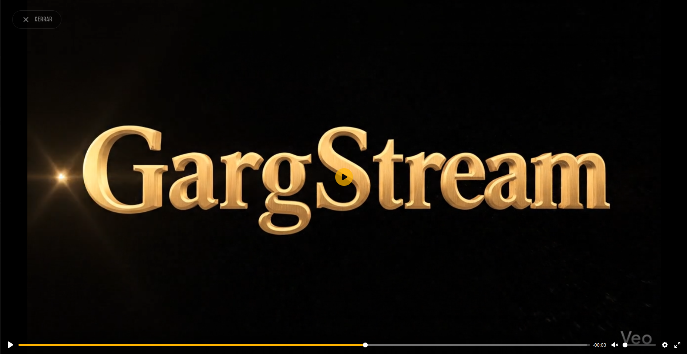

# GargStream

> **Plataforma de streaming bajo demanda diseñada para la gestión y visualización de contenido multimedia.**

   

## Descripción del Proyecto

**GargStream** es una aplicación web full-stack que simula un servicio de streaming. El objetivo principal es permitir a los usuarios consultar, buscar y visualizar **Películas**, **Series** y **Videos Personales**, diferenciando claramente entre contenido público y privado mediante un sistema de roles.

### Funcionalidades Principales

* **Roles de Usuario:**
    * **Invitado:** Acceso limitado al catálogo y visualización de tráilers.
    * **Usuario Registrado:** Reproducción completa, gestión de "Mi Lista", valoración por estrellas y sistema de reanudación.
    * **Administrador:** Panel de control CRUD para subir vídeos, gestionar carátulas, editar metadatos y administrar usuarios.
* **Seguridad:** Implementación de **Spring Security** con autenticación, autorización por roles y protección CSRF.
* **Reproductor:** Integración de **Plyr.js** para una experiencia de usuario fluida y moderna.
* **Persistencia:** Uso de base de datos H2 en modo archivo para facilitar la portabilidad sin instalar servidores SQL externos.

---

## Galería de Imágenes

Aquí puedes ver el aspecto de la aplicación en funcionamiento:

| Página Principal (Catálogo) | Vista de Detalle y Votación |
| :---: | :---: |
| | |
|  |  |

| Panel de Administración | Reproductor de Vídeo |
| :---: | :---: |
| | |
|  |  |


---

## Tecnologías Utilizadas

| Categoría | Tecnologías |
| :--- | :--- |
| **Backend** | Java 21, Spring Boot 3, Spring Security, Spring Data JPA, Maven |
| **Frontend** | Thymeleaf, HTML5, CSS3, JavaScript |
| **Base de Datos** | H2 Database (File-based) |
| **Herramientas** | IntelliJ IDEA, Git |

---

## Estructura del Proyecto

El código está organizado siguiendo el patrón de arquitectura MVC:

* **`src/main/java/com/gargstream`**
    * 📂 **`config`**: Configuraciones de seguridad (Spring Security) e inicialización de datos.
    * 📂 **`controller`**: Controladores que manejan las rutas y peticiones HTTP.
    * 📂 **`dto`**: Objetos de Transferencia de Datos para comunicación segura entre capas.
    * 📂 **`exception`**: Manejo centralizado de errores y excepciones personalizadas.
    * 📂 **`model`**: Entidades JPA que representan las tablas de la base de datos.
    * 📂 **`repository`**: Interfaces de acceso a datos.
    * 📂 **`service`**: Lógica de negocio, envío de correos y gestión de archivos.
* **`src/main/resources`**
    * 📂 **`static`**: Recursos públicos (hojas de estilo CSS, scripts JS e imágenes).
    * 📂 **`templates`**: Vistas HTML renderizadas con **Thymeleaf**.
        * 📂 **`error`**: Páginas personalizadas para errores.
    * 📄 **`application.properties`**: Configuración principal del servidor y credenciales.

---
## Requisitos y Ejecución

Para arrancar el proyecto en tu entorno local, sigue estos pasos:

### Prerrequisitos
1.  **Java JDK 21** instalado.
2.  **IntelliJ IDEA** (u otro IDE compatible con Maven).

### Pasos para arrancar
1.  **Clonar/Descargar el proyecto:**
    Descarga el código y abre la carpeta raíz en IntelliJ IDEA.
    
2.  **Cargar Dependencias:**
    Si es la primera vez, haz clic derecho en el archivo `pom.xml` > **Maven** > **Reload Project**.

3.  **Ejecutar:**
    Busca la clase principal: `src/main/java/com/gargstream/GargStreamApplication.java` y dale al botón de **Play**.

4.  **Acceder:**
    Una vez veas en la consola que Tomcat ha iniciado, abre tu navegador en:
    **[http://localhost:9016](http://localhost:9016)**

---

## Configuración de Servicios Externos (API & Correo)

Para que la aplicación funcione correctamente (descarga de información de películas y envío de correos de recuperación), **es necesario configurar tus propias credenciales**.

Abre el archivo de configuración ubicado en:
`src/main/resources/application.properties`

### 1. API de TMDB (Películas y Series)
El proyecto utiliza la API de **The Movie Database (TMDB)** para obtener títulos, sinopsis y carátulas automáticamente.
* Regístrate en [themoviedb.org](https://www.themoviedb.org/) y solicita una **API Key** gratuita.
* Busca esta línea en el archivo y pega tu clave:

```properties
# Reemplaza 'TU_CLAVE_AQUI' por tu API Key real
tmdb.api.key=TU_CLAVE_AQUI
```

### Configuración de Correo (Recuperación de Contraseña)

Para que la aplicación pueda enviar **códigos de verificación** y correos para restablecer contraseñas olvidadas, es necesario configurar el servidor de correo.

El proyecto está preconfigurado para **Gmail**, pero necesitas poner tus credenciales en el archivo `src/main/resources/application.properties`:

```properties
# 1. Tu dirección de correo (Gmail)
spring.mail.username=tu_correo@gmail.com

# 2. Tu Contraseña de Aplicación
# IMPORTANTE: No uses tu contraseña normal de Google.
# Debes generar una contraseña específica de 16 caracteres en:
# Google Account > Seguridad > Verificación en 2 pasos > Contraseñas de aplicaciones
spring.mail.password=tu_contraseña_de_aplicacion_aqui
```
---

## Usuarios de Prueba

El sistema utiliza una base de datos local (H2). Puedes usar estas credenciales para probar los diferentes roles:

| Rol | Email | Contraseña | Descripción |
| :--- | :--- | :--- | :--- |
| **Administrador** | `admin@gargstream.es` | `1234` | Acceso total al panel de gestión y catálogo. |
| **Usuario** | *(Registro libre)* | - | Puedes registrarte desde la web para probar el perfil de usuario normal. |

---

## Inicialización de Datos (Restauración)

El proyecto incluye un mecanismo de seguridad para regenerar el usuario administrador en caso de que borres la base de datos (carpeta `data`) para empezar de cero.

Si necesitas restaurar el acceso de administrador:

1.  Abre el archivo: `src/main/java/com/gargstream/config/DataInitializer.java`.
2.  **Descomenta** las líneas de código que crean el usuario admin.
3.  Arranca la aplicación una vez (esto creará el usuario en la nueva base de datos).
4.  (Opcional) Vuelve a comentar el código para evitar que se ejecute en cada inicio.

---

## Autor

**Diego Pérez Valero**
* **Asignatura:** Programación de aplicaciones utilizando frameworks.
